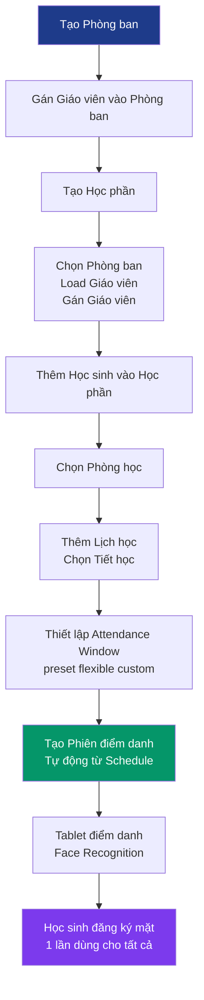

## Flutter Frontend - Phase 9/10 Integration Plan

---

## 1. Kiến trúc tổng quan

```
┌─────────────────────────────────────────────────────────┐
│                      BACKEND                            │
│  Department ←→ Teacher ←→ Course ←→ Schedule ←→ Session │
│       ↓              ↓           ↓            ↓         │
│     Room ←── Device  Room    Enrollment   Attendance     │
│                    (tablet)                             │
└─────────────────────────────────────────────────────────┘
                           ↕ API v1
┌─────────────────────────────────────────────────────────┐
│                   FLUTTER FRONTEND                      │
│  DepartmentPage → TeacherPage → CoursePage → Schedule   │
│       ↓               ↓           ↓          Page       │
│  TeacherAssign   StudentEnroll  RoomSelect  SessionPage │
└─────────────────────────────────────────────────────────┘
```

### Mô hình flow mới:

1. Tạo **Phòng ban** (Department) → Gán **Giáo viên** vào phòng ban
2. Tạo **Học phần** (Course) → Chọn phòng ban → Load giáo viên → Gán giáo viên → Thêm học sinh → Chọn phòng học → Chọn tiết học (TimeSlot) → Thiết lập attendance window
3. Từ Học phần → Tạo **Phiên điểm danh** (Session) tự động theo schedule
4. **Tablet**: Học sinh đăng ký khuôn mặt 1 lần → Dùng cho tất cả học phần

---

## 2. Thêm API Endpoints

**File: `lib/data/remote/api_endpoint.dart`**

Thêm các endpoint mới:

```dart
// Departments
static const String departments = '/api/v1/departments/';
static const String departmentById = '/api/v1/departments/'; // + {id}

// Rooms
static const String rooms = '/api/v1/rooms/';
static const String roomCourses = '/api/v1/rooms/'; // + {id}/courses

// Courses
static const String courses = '/api/v1/courses/';
static const String courseStudents = '/api/v1/courses/'; // + {id}/students
static const String courseAssignRoom = '/api/v1/courses/'; // + {id}/assign-room

// Schedules
static const String schedules = '/api/v1/schedules/';

// Sessions
static const String sessions = '/api/v1/sessions/';
static const String sessionSummary = '/api/v1/sessions/'; // + {id}/summary
static const String sessionActivate = '/api/v1/sessions/'; // + {id}/activate
static const String sessionClose = '/api/v1/sessions/'; // + {id}/close
static const String sessionGenerateDaily = '/api/v1/sessions/generate-daily';

// TimeSlots (reference only - no dedicated router, use from schedule)
static const String timeSlots = '/api/v1/time-slots/';
```

---

## 3. Tạo Entity Models mới

**File: `lib/entities/department.dart`**

```dart
class Department {
  final String id;
  final String code;
  final String name;
  final String? description;
  final int? teacherCount;
  final DateTime createdAt;
  final DateTime? updatedAt;

  factory Department.fromJson(Map<String, dynamic> json);
  Map<String, dynamic> toJson();
}
```

**File: `lib/entities/room.dart`**

```dart
class Room {
  final String id;
  final String code;
  final String name;
  final String? building;
  final int? floor;
  final int? capacity;

  factory Room.fromJson(Map<String, dynamic> json);
  Map<String, dynamic> toJson();
}
```

**File: `lib/entities/time_slot.dart`**

```dart
class TimeSlot {
  final String id;
  final String slotName; // e.g., "Tiết 1"
  final String startTime; // "07:00"
  final String endTime;   // "07:45"
  final int slotOrder;

  factory TimeSlot.fromJson(Map<String, dynamic> json);
}
```

**File: `lib/entities/course.dart`**

```dart
enum AttendanceMode { preset, flexible, custom }

class Course {
  final String id;
  final String courseName;
  final String? subject;
  final String? courseCode;
  final String? departmentId;
  final String? departmentName;
  final String? instructorId;
  final String? instructorName;
  final String? roomId;
  final String? roomName;
  final AttendanceMode attendanceMode;
  final int attendanceBeforeMinutes; // 30
  final int attendanceAfterMinutes;  // 30
  final int enrolledCount;
  final DateTime createdAt;

  factory Course.fromJson(Map<String, dynamic> json);
  Map<String, dynamic> toJson();
}
```

**File: `lib/entities/schedule.dart`**

```dart
class Schedule {
  final String id;
  final String courseId;
  final int dayOfWeek; // 1=Monday, 7=Sunday
  final String? timeSlotId;
  final TimeSlot? timeSlot;

  factory Schedule.fromJson(Map<String, dynamic> json);
  Map<String, dynamic> toJson();
}
```

**File: `lib/entities/session.dart`**

```dart
enum SessionStatus { scheduled, active, closed }

class Session {
  final String id;
  final String courseId;
  final String? courseName;
  final String? scheduleId;
  final DateTime? sessionDate;
  final String startTime;
  final String? endTime;
  final String? checkinWindowStart;
  final String? checkinWindowEnd;
  final SessionStatus status;
  final int presentCount;
  final int absentCount;
  final int totalCount;
  final DateTime createdAt;

  factory Session.fromJson(Map<String, dynamic> json);
  Map<String, dynamic> toJson();
}
```

**File: `lib/entities/course_student.dart`**

```dart
class CourseStudent {
  final String studentId;
  final String? userId;
  final String? pin;
  final String? name;
  final bool hasFace;
  final int embeddingCount;
  final DateTime enrolledAt;

  factory CourseStudent.fromJson(Map<String, dynamic> json);
}
```

---

## 4. Tạo Services/Repositories mới

**File: `lib/data/remote/department_service.dart`**

```dart
abstract class DepartmentService {
  Future<DataState<List<Department>>> getDepartments();
  Future<DataState<Department>> getDepartment(String id);
  Future<DataState<Department>> createDepartment(DepartmentCreateRequest req);
  Future<DataState<Department>> updateDepartment(String id, DepartmentUpdateRequest req);
  Future<DataState<void>> deleteDepartment(String id);
  Future<DataState<Department>> getDepartmentWithStats(String id);
}
```

**File: `lib/data/remote/room_service.dart`**

```dart
abstract class RoomService {
  Future<DataState<List<Room>>> getRooms({int? limit, int? offset});
  Future<DataState<Room>> getRoom(String id);
  Future<DataState<Room>> createRoom(RoomCreateRequest req);
  Future<DataState<Room>> updateRoom(String id, RoomUpdateRequest req);
  Future<DataState<void>> deleteRoom(String id);
}
```

**File: `lib/data/remote/course_service.dart`**

```dart
abstract class CourseService {
  Future<DataState<List<Course>>> getCourses({String? departmentId, bool? mine});
  Future<DataState<Course>> getCourse(String id);
  Future<DataState<Course>> createCourse(CourseCreateRequest req);
  Future<DataState<void>> deleteCourse(String id);
  Future<DataState<Room?>> assignRoom(String courseId, String roomId);
  Future<DataState<List<CourseStudent>>> getCourseStudents(String courseId);
  Future<DataState<void>> enrollStudent(String courseId, String studentId);
  Future<DataState<void>> unenrollStudent(String courseId, String studentId);
}
```

**File: `lib/data/remote/schedule_service.dart`**

```dart
abstract class ScheduleService {
  Future<DataState<List<Schedule>>> getSchedules({String? courseId, int? dayOfWeek});
  Future<DataState<Schedule>> createSchedule(ScheduleCreateRequest req);
  Future<DataState<void>> deleteSchedule(String id);
}
```

**File: `lib/data/remote/session_service.dart`**

```dart
abstract class SessionService {
  Future<DataState<List<Session>>> getSessions({String? courseId, DateTime? date, String? status});
  Future<DataState<Session>> getSession(String id);
  Future<DataState<Session>> createSession(SessionCreateRequest req);
  Future<DataState<Session>> updateSession(String id, SessionUpdateRequest req);
  Future<DataState<void>> deleteSession(String id);
  Future<DataState<SessionSummary>> getSessionSummary(String id);
  Future<DataState<Session>> activateSession(String id);
  Future<DataState<Session>> closeSession(String id);
  Future<DataState<List<Session>>> generateDailySessions(DateTime date);
}
```

---

## 5. Thêm BLoC/Cubit State Management

`**lib/pages/department/bloc/department_bloc.dart**`

- States: DepartmentInitial, DepartmentLoading, DepartmentLoaded, DepartmentError
- Events: LoadDepartments, CreateDepartment, UpdateDepartment, DeleteDepartment

`**lib/pages/teacher/bloc/teacher_bloc.dart**`

- States: TeacherInitial, TeacherLoading, TeacherLoaded, TeacherError
- Events: LoadTeachers, AssignTeacherToDepartment, RemoveTeacherFromDepartment
- Filter teachers by department_id

`**lib/pages/room/bloc/room_bloc.dart**`

- States: RoomInitial, RoomLoading, RoomLoaded, RoomError
- Events: LoadRooms, CreateRoom, UpdateRoom, DeleteRoom

`**lib/pages/course/bloc/course_bloc.dart**`

- States: CourseInitial, CourseLoading, CourseLoaded, CourseError
- Events: LoadCourses, LoadCourseDetail, CreateCourse, AssignRoom, EnrollStudent, UnenrollStudent

`**lib/pages/schedule/bloc/schedule_bloc.dart**`

- States: ScheduleInitial, ScheduleLoading, ScheduleLoaded, ScheduleError
- Events: LoadSchedules, CreateSchedule, DeleteSchedule

`**lib/pages/session/bloc/session_bloc.dart**`

- States: SessionInitial, SessionLoading, SessionLoaded, SessionError
- Events: LoadSessions, CreateSession, ActivateSession, CloseSession, GetSessionSummary

---

## 6. Tạo UI Screens mới

### 6.1. Department Management

`**lib/pages/department/department_list_page.dart**`

- Danh sách phòng ban (fetch từ `/api/v1/departments/`)
- FAB: Thêm phòng ban mới
- Mỗi item: Mã phòng ban, Tên, Số giáo viên
- Tap: Navigate đến DepartmentDetailPage

`**lib/pages/department/department_form_page.dart**`

- Form tạo/sửa phòng ban: Mã phòng ban, Tên, Mô tả
- Validate: Mã và Tên bắt buộc

`**lib/pages/department/department_detail_page.dart**`

- Thông tin phòng ban
- Danh sách giáo viên thuộc phòng ban
- Nút gán/bỏ gán giáo viên
- Nút xóa phòng ban

### 6.2. Teacher Assignment

`**lib/pages/teacher/teacher_assignment_page.dart**`

- Chọn phòng ban trước
- Load giáo viên từ `/api/v1/users/?role=teacher`
- Checkbox chọn giáo viên để gán vào phòng ban
- Gán: `POST /api/v1/teachers/{id}/assign-department`
- Bỏ gán: `DELETE /api/v1/teachers/{id}/assign-department`

### 6.3. Room Management

`**lib/pages/room/room_list_page.dart**`

- Danh sách phòng học (fetch từ `/api/v1/rooms/`)
- FAB: Thêm phòng học mới
- Mỗi item: Mã phòng, Tên, Tầng, Sức chứa

`**lib/pages/room/room_form_page.dart**`

- Form tạo/sửa phòng học: Mã phòng, Tên, Tòa nhà, Tầng, Sức chứa

### 6.4. Course Management (Học phần)

`**lib/pages/course/course_list_page.dart**` (Cập nhật)

- Thay mock data bằng fetch từ `/api/v1/courses/`
- Card: Mã học phần, Tên, Giáo viên, Phòng, Sĩ số
- FAB: Tạo học phần mới
- Tap: Navigate đến CourseDetailPage

`**lib/pages/course/course_form_page.dart**` (TẠO MỚI)

- Form tạo học phần:
  - Tên học phần (bắt buộc)
  - Mã học phần (tùy chọn)
  - Môn học (tùy chọn)
  - Phòng ban: Dropdown từ `/api/v1/departments/` → Sau khi chọn load danh sách giáo viên
  - Giáo viên: Dropdown từ `/api/v1/users/?role=teacher` (filter theo department nếu có)
  - Phòng học: Dropdown từ `/api/v1/rooms/`
  - **Attendance Mode**: 3 radio buttons:
    - `preset` = "30 phút trước và 30 phút sau giờ học"
    - `flexible` = "Luôn cho phép điểm danh (không giới hạn)"
    - `custom` = "Tự thiết lập thời gian"
  - Nếu chọn `custom`: Thêm input `attendance_before_minutes` và `attendance_after_minutes`

`**lib/pages/course/course_detail_page.dart`** (TẠO MỚI)

- Thông tin học phần
- Tab: Thông tin | Lịch học | Học sinh | Phiên điểm danh

### 6.5. Schedule Management

`**lib/pages/schedule/schedule_page.dart`**

- Chọn ngày trong tuần (2-7)
- Load tiết học từ TimeSlot config (hardcoded hoặc từ API)
- Chọn tiết: Dropdown (Tiết 1: 07:00-07:45, Tiết 2: 07:50-08:35, ...)
- Thêm lịch: `POST /api/v1/schedules/` với course_id, day_of_week, time_slot_id
- Danh sách lịch của học phần
- Xóa lịch: `DELETE /api/v1/schedules/{id}`
- **Validate**: Nếu session chưa đóng mà thời gian setup ngoài khung giờ học → Báo lỗi "Không thể đặt lịch ngoài giờ học"

### 6.6. Student Enrollment

`**lib/pages/course/course_students_page.dart`**

- Danh sách học sinh đã đăng ký trong học phần
- Load từ `/api/v1/courses/{id}/students`
- Hiển thị: Tên, MSSV, đã đăng ký khuôn mặt (icon check)
- FAB: Thêm học sinh → Mở dialog với search từ `/api/v1/users/?role=student`
- Xóa học sinh khỏi học phần: `DELETE /api/v1/courses/{id}/students/{studentId}`

### 6.7. Session Management (Phiên điểm danh)

`**lib/pages/session/session_list_page.dart`**

- Danh sách phiên điểm danh của học phần
- Filter theo ngày, trạng thái
- Card: Tên học phần, Ngày, Giờ bắt đầu, Trạng thái (Scheduled/Active/Closed)
- FAB: Tạo phiên thủ công

`**lib/pages/session/session_form_page.dart`**

- Form tạo phiên:
  - Chọn học phần
  - Chọn ngày
  - Chọn giờ bắt đầu
  - Chọn giờ kết thúc
  - Attendance window (auto từ course.attendance_mode)
  - Trạng thái: Scheduled

`**lib/pages/session/session_detail_page.dart`**

- Thông tin phiên: Tên học phần, Ngày, Giờ, Attendance window
- Nút "Bắt đầu điểm danh" → `POST /api/v1/sessions/{id}/activate`
- Nút "Kết thúc điểm danh" → `POST /api/v1/sessions/{id}/close`
- Thống kê: Đã điểm danh / Vắng mặt
- **Tablet**: Mở CheckingPage với session_id

### 6.8. Attendance Mode Selection UI

**Trong CourseFormPage và CourseDetailPage:**

```dart
enum AttendanceModeOption {
  preset,   // "30 phút trước - 30 phút sau giờ học"
  flexible, // "Luôn cho phép điểm danh (không giới hạn)"
  custom,   // "Tự thiết lập"
}
```

### 6.9. Cập nhật Navigation

**File: `lib/route/app_route.dart`**
Thêm routes mới:

```dart
static const String departmentList = '/departments';
static const String departmentForm = '/departments/form';
static const String departmentDetail = '/departments/detail';
static const String teacherAssignment = '/teachers/assignment';
static const String roomList = '/rooms';
static const String roomForm = '/rooms/form';
static const String courseDetail = '/courses/detail';
static const String courseForm = '/courses/form';
static const String courseStudents = '/courses/students';
static const String schedule = '/schedule';
static const String sessionList = '/sessions';
static const String sessionForm = '/sessions/form';
static const String sessionDetail = '/sessions/detail';
```

**Cập nhật `lib/pages/tab/tab.dart`:**

- Thay tab "Học phần" (index 1) dùng CourseListPage đã cập nhật
- Tab "Thông báo" (index 2) → Giữ placeholder
- Thêm menu vào Settings cho Department, Room

### 6.10. Cập nhật Settings Menu

**Thêm vào `lib/pages/setting/setting_page.dart`:**

```dart
_buildSettingItem(
  icon: Icons.business,
  title: "Quản lý phòng ban",
  subtitle: "Thêm, sửa, xóa phòng ban",
  onTap: () => AppNavigator.pushNamed(RouterName.departmentList),
),
_buildSettingItem(
  icon: Icons.meeting_room,
  title: "Quản lý phòng học",
  subtitle: "Thêm, sửa, xóa phòng học",
  onTap: () => AppNavigator.pushNamed(RouterName.roomList),
),
```

---

## 7. Cập nhật Attendance/Checking Flow cho Session-based

**File: `lib/pages/checking/checking_page.dart`**

Cập nhật flow điểm danh:

```dart
// Thay vì check-in/out đơn lẻ, giờ cần:
// 1. Mở CheckingPage với session_id
// 2. Gọi API attendance theo session: POST /api/v1/attendances/
// 3. Payload: { session_id, student_id, checkin_time, image_base64 }

// Anti-cheat:
// - Validate device.room_id == course.room_id (backend đã làm)
// - Nếu học sinh chưa đăng ký khuôn mặt → Báo "Vui lòng đăng ký khuôn mặt trước"
```

---

## 8. Tính năng Face tập trung (Cross-device)

**Logic hiện tại đã đúng hướng, chỉ cần đảm bảo:**

- Học sinh đăng ký khuôn mặt 1 lần trên bất kỳ tablet nào
- `POST /api/student/update/embedding` → Lưu lên server
- Tất cả tablet khác pull face data qua `GET /api/student/export/json`
- Sync định kỳ qua Workmanager (đã có trong LocalService)

---

## 9. TimeSlot Config (Hardcoded - như bảng slot time)

**File: `lib/data/models/time_slot_config.dart`**

```dart
class TimeSlotConfig {
  static const List<TimeSlot> defaultSlots = [
    TimeSlot(id: '1', slotName: 'Tiết 1', startTime: '07:00', endTime: '07:45', slotOrder: 1),
    TimeSlot(id: '2', slotName: 'Tiết 2', startTime: '07:50', endTime: '08:35', slotOrder: 2),
    TimeSlot(id: '3', slotName: 'Tiết 3', startTime: '08:40', endTime: '09:25', slotOrder: 3),
    TimeSlot(id: '4', slotName: 'Tiết 4', startTime: '09:30', endTime: '10:15', slotOrder: 4),
    TimeSlot(id: '5', slotName: 'Tiết 5', startTime: '10:20', endTime: '11:05', slotOrder: 5),
    TimeSlot(id: '6', slotName: 'Tiết 6', startTime: '13:00', endTime: '13:45', slotOrder: 6),
    TimeSlot(id: '7', slotName: 'Tiết 7', startTime: '13:50', endTime: '14:35', slotOrder: 7),
    TimeSlot(id: '8', slotName: 'Tiết 8', startTime: '14:40', endTime: '15:25', slotOrder: 8),
    TimeSlot(id: '9', slotName: 'Tiết 9', startTime: '15:30', endTime: '16:15', slotOrder: 9),
    TimeSlot(id: '10', slotName: 'Tiết 10', startTime: '16:20', endTime: '17:05', slotOrder: 10),
  ];
}
```

---

## 10. Điều chỉnh Backend (nếu thiếu API)

Sau khi triển khai Flutter, nếu có lỗi thiếu API, cần bổ sung backend:

### 10.1. Thêm `PUT /api/v1/courses/{id}` (nếu chưa có)

```python
# backend/app/routers/v1/courses.py
@router.put("/{course_id}", response_model=CourseOut)
def update_course(course_id: UUID, data: CourseUpdate, ...)
```

### 10.2. Thêm `PUT /api/v1/schedules/{id}` (nếu chưa có)

```python
# backend/app/routers/v1/schedules.py
@router.put("/{schedule_id}", response_model=ScheduleOut)
def update_schedule(schedule_id: UUID, data: ScheduleUpdate, ...)
```

### 10.3. Nếu thiếu TimeSlot model/router

- Tạo `backend/app/models/time_slot.py`
- Tạo `backend/app/routers/v1/time_slots.py`
- CRUD: GET /time-slots/

### 10.4. Thêm enrollment batch API

```python
@router.post("/courses/{course_id}/students/batch")
def enroll_students_batch(course_id: UUID, student_ids: List[str], ...)
```

---

## 11. Thứ tự triển khai (đề xuất)

### Giai đoạn 1: Infrastructure (2-3 ngày)

1. Thêm API endpoints vào `api_endpoint.dart`
2. Tạo entity models (Department, Room, TimeSlot, Course, Schedule, Session)
3. Tạo services (DepartmentService, RoomService, CourseService, ScheduleService, SessionService)
4. Đăng ký services vào DI (`lib/di/injection.dart`)

### Giai đoạn 2: Department + Room + Teacher (2-3 ngày)

1. Tạo DepartmentBloc và DepartmentListPage
2. Tạo RoomBloc và RoomListPage
3. Cập nhật TeacherListPage → Thêm chức năng gán phòng ban

### Giai đoạn 3: Course Management (3-4 ngày)

1. Cập nhật CourseBloc → Gọi API thật
2. Tạo CourseFormPage với 3 attendance mode options
3. Tạo CourseDetailPage với tabs

### Giai đoạn 4: Schedule + Session (2-3 ngày)

1. Tạo SchedulePage với TimeSlot picker
2. Tạo SessionBloc và SessionListPage
3. Tạo SessionDetailPage với activate/close buttons

### Giai đoạn 5: Integration & Testing (2-3 ngày)

1. Cập nhật CheckingPage để hoạt động với session_id
2. Cập nhật navigation
3. Cập nhật Settings menu
4. Test end-to-end flow

### Giai đoạn 6: Documentation (1 ngày)

1. Viết `doc/backend/phase_10_flutter_integration_report.md` mô tả những gì đã triển khai

---

## 12. Key Files to Create/Modify Summary


| File                                                 | Action                        |
| ---------------------------------------------------- | ----------------------------- |
| `lib/data/remote/api_endpoint.dart`                  | MODIFY - Thêm endpoints mới   |
| `lib/entities/department.dart`                       | CREATE                        |
| `lib/entities/room.dart`                             | CREATE                        |
| `lib/entities/time_slot.dart`                        | CREATE                        |
| `lib/entities/course.dart`                           | CREATE                        |
| `lib/entities/schedule.dart`                         | CREATE                        |
| `lib/entities/session.dart`                          | CREATE                        |
| `lib/entities/course_student.dart`                   | CREATE                        |
| `lib/data/models/time_slot_config.dart`              | CREATE                        |
| `lib/data/remote/department_service.dart`            | CREATE                        |
| `lib/data/remote/room_service.dart`                  | CREATE                        |
| `lib/data/remote/course_service.dart`                | CREATE                        |
| `lib/data/remote/schedule_service.dart`              | CREATE                        |
| `lib/data/remote/session_service.dart`               | CREATE                        |
| `lib/pages/department/bloc/department_bloc.dart`     | CREATE                        |
| `lib/pages/department/department_list_page.dart`     | CREATE                        |
| `lib/pages/department/department_form_page.dart`     | CREATE                        |
| `lib/pages/department/department_detail_page.dart`   | CREATE                        |
| `lib/pages/room/bloc/room_bloc.dart`                 | CREATE                        |
| `lib/pages/room/room_list_page.dart`                 | CREATE                        |
| `lib/pages/room/room_form_page.dart`                 | CREATE                        |
| `lib/pages/teacher/bloc/teacher_bloc.dart`           | CREATE                        |
| `lib/pages/teacher/teacher_assignment_page.dart`     | CREATE                        |
| `lib/pages/course/bloc/course_bloc.dart`             | CREATE                        |
| `lib/pages/course/course_list_page.dart`             | MODIFY - Thay mock bằng API   |
| `lib/pages/course/course_form_page.dart`             | CREATE                        |
| `lib/pages/course/course_detail_page.dart`           | CREATE                        |
| `lib/pages/course/course_students_page.dart`         | CREATE                        |
| `lib/pages/schedule/bloc/schedule_bloc.dart`         | CREATE                        |
| `lib/pages/schedule/schedule_page.dart`              | CREATE                        |
| `lib/pages/session/bloc/session_bloc.dart`           | CREATE                        |
| `lib/pages/session/session_list_page.dart`           | CREATE                        |
| `lib/pages/session/session_form_page.dart`           | CREATE                        |
| `lib/pages/session/session_detail_page.dart`         | CREATE                        |
| `lib/pages/checking/checking_page.dart`              | MODIFY - Thêm session_id      |
| `lib/route/app_route.dart`                           | MODIFY - Thêm routes          |
| `lib/pages/setting/setting_page.dart`                | MODIFY - Thêm menu items      |
| `lib/pages/tab/tab.dart`                             | MODIFY - Cập nhật tabs        |
| `lib/di/injection.dart`                              | MODIFY - Đăng ký services mới |
| `doc/backend/phase_10_flutter_integration_report.md` | CREATE - Documentation        |


---

## 13. Backend Adjustments (nếu cần)

Sau khi triển khai Flutter, nếu backend thiếu API, bổ sung:


| File                                           | Action                                |
| ---------------------------------------------- | ------------------------------------- |
| `backend/app/routers/v1/courses.py`            | Thêm `PUT /{course_id}` endpoint      |
| `backend/app/routers/v1/schedules.py`          | Thêm `PUT /{schedule_id}` endpoint    |
| `backend/app/routers/v1/time_slots.py`         | Tạo mới nếu chưa có                   |
| `backend/app/schemas/v1/course.py`             | Thêm CourseUpdate schema              |
| `backend/app/services/attendance_validator.py` | Kiểm tra attendance window validation |


---

## 14. Mermaid Flow Diagram




