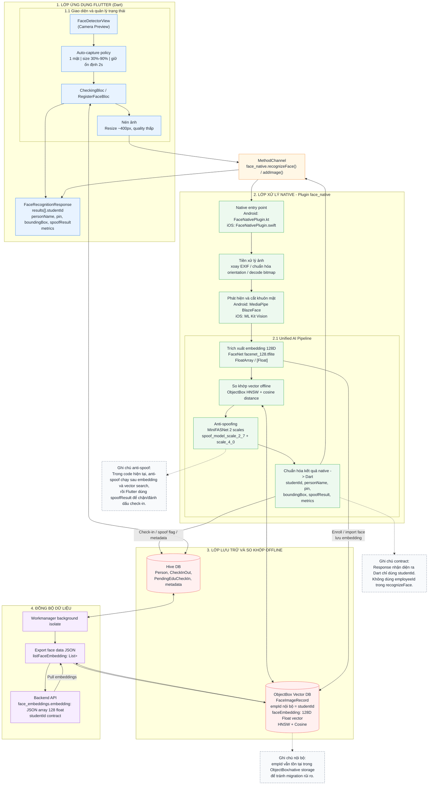

# Sơ đồ kiến trúc mobile và nhận diện khuôn mặt



## Contract nhận diện

```json
{
  "results": [
    {
      "studentId": 123,
      "personName": "Nguyen Van A",
      "pin": "...",
      "boundingBox": {
        "left": 0,
        "top": 0,
        "right": 100,
        "bottom": 100
      },
      "spoofResult": {
        "isSpoof": false,
        "score": 0.95,
        "timeMillis": 120
      }
    }
  ],
  "metrics": {
    "timeFaceDetection": 10,
    "timeFaceEmbedding": 30,
    "timeVectorSearch": 5,
    "timeFaceSpoofDetection": 120
  }
}
```
